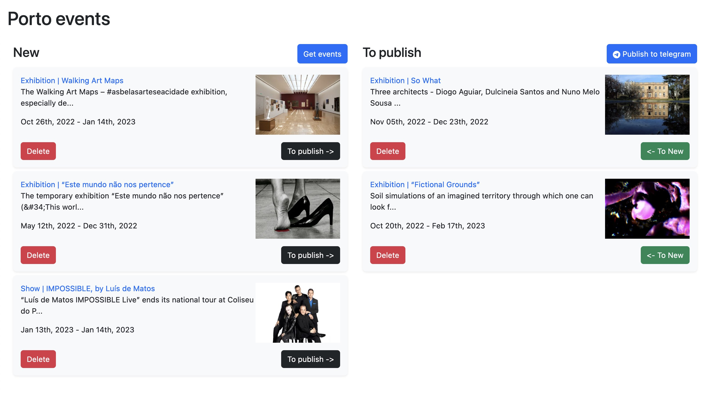
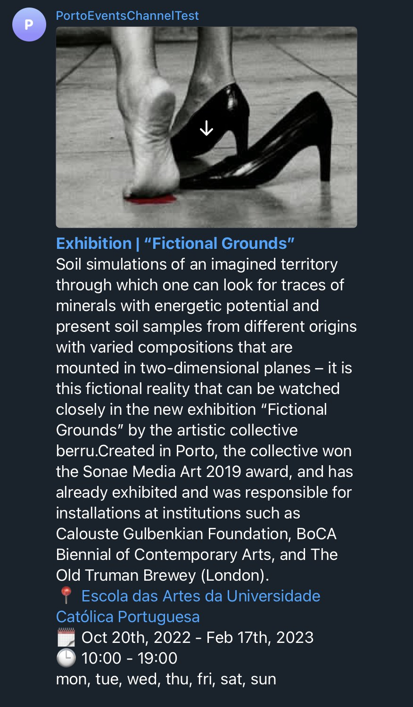

Porto Events
====

Collect Porto city events from popular resources and post them to telegram channel

Web server screenshot

Telegram channel post screenshot

## Features
- Scrap or get from API the list of events based on a few resources
- Send events to telegram channel
- Web server: 
  - Show collected events in the list "New"
  - Init collection of new events (add only new, not existed events)
  - Edit/Delete events
  - Move new event to "Publish" list
  - Init sending "Publish" list to telegram
- Store events in DB (BoltDB)

#### Features under development
- Scheduler to collect new events automatically  
- Scheduler to publish events to telegram automatically  
- Add simple auth service for website
- Add config page (config schedulers, resources list enable/disable and so on)
- Add errors notification to the frontend

## Installation
- configs prepare
  - copy file config `configs/config-example.toml` an rename to `configs/config.toml`
  - add telegram token & channel id

## Store data explanation
The initial idea was to create a simple and handy solution to manage the information about the upcoming events.
With the option to see new events, edit existing ones and send them to the `Publish` list with the further publishing into telegram channel.
From start, where decision not create own web server with DB and website for that.

Instead of that, app NOTION seemed to be better choice due to simple manipulation of events data for client.
One note to store the configuration settings (how often to collect events from resources, how often to post to telegram, etc.). 
One note to show/edit/delete the events list. 
It seemed easy, since Notion has APi. But, nevertheless, it appeared that Notion uses difficult note data structure with different blocks, which made it difficult to operate the data via api to save and forward it to telegram.

With this problem in mind, another solution was chosen (more classic). It was decided to create personal web server and store the data in light key/value DB (BoltDB) without any additional installation requirements for the hosting

**Notion is under development stage. Not ready to use**

## Resources for get events
* [Porto.pt](https://www.porto.pt/en/events)
* [Agendaculturalporto.org](https://agendaculturalporto.org/agenda-maus-habitos-porto)
